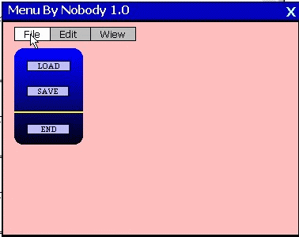

## CoolMenu with animation, more font,colour\.\.\.

### Description

Menu with colours, animation (open), font etc...
 
### More Info
 

             |
---                |---
**Submitted On**   |2001-10-19 00:34:20
**By**             |[Surlina](https://github.com/Planet-Source-Code/PSCIndex/blob/master/ByAuthor/surlina.md)
**Level**          |Intermediate
**User Rating**    |3.2 (16 globes from 5 users)
**Compatibility**  |VB 4\.0 \(16\-bit\), VB 4\.0 \(32\-bit\), VB 5\.0, VB 6\.0
**Category**       |[Complete Applications](https://github.com/Planet-Source-Code/PSCIndex/blob/master/ByCategory/complete-applications__1-27.md)
**World**          |[Visual Basic](https://github.com/Planet-Source-Code/PSCIndex/blob/master/ByWorld/visual-basic.md)
**Archive File**   |[CoolMenu w2976010182001\.zip](https://github.com/Planet-Source-Code/surlina-coolmenu-with-animation-more-font-colour__1-28180/archive/master.zip)

